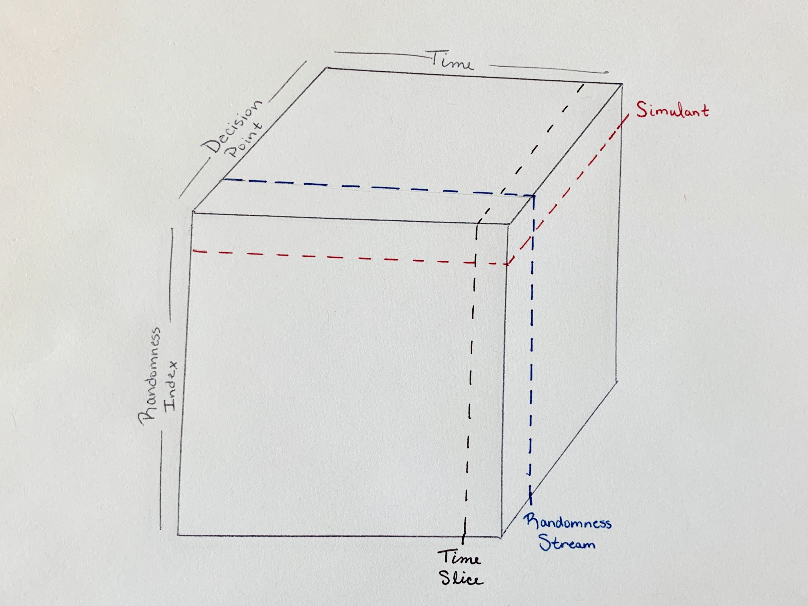
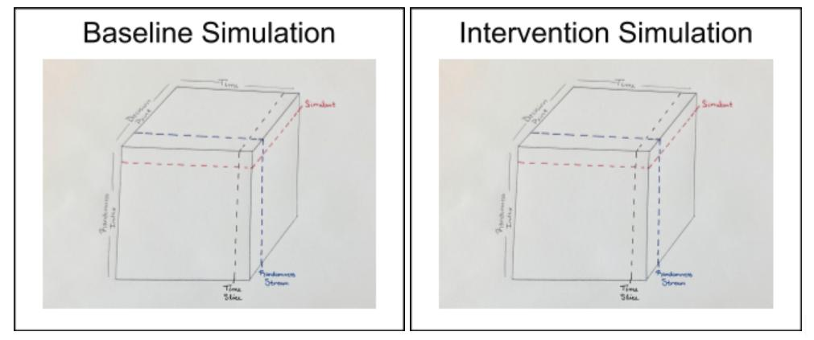
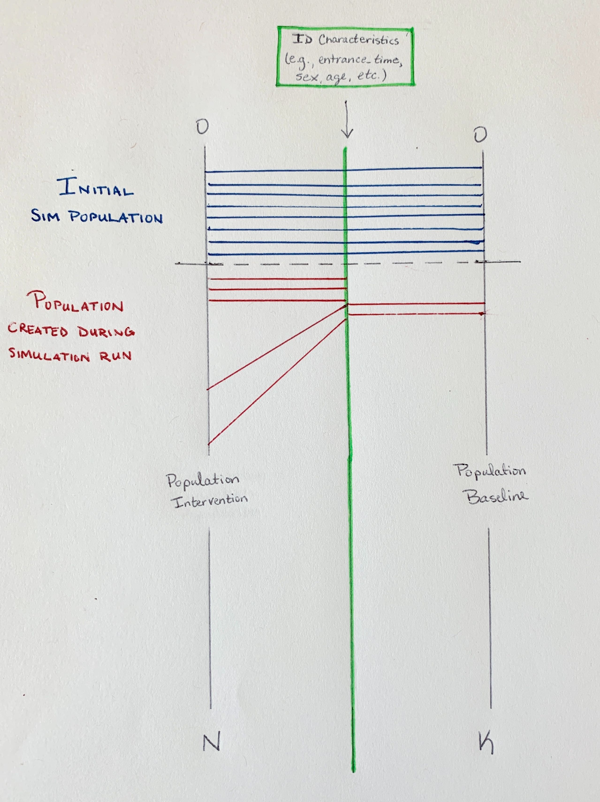

.. _crn_concept:

=====================
Common Random Numbers
=====================

.. contents::
   :depth: 2
   :local:
   :backlinks: none

So why exactly are randomness and specifically common random numbers important
in ``vivarium`` simulations? The answer has to do with the somewhat peculiar
needs of ``vivarium`` around randomness: we need to ensure that we are totally
consistent between branches in a comparison. If we want to run a baseline and
a counterfactual simulation in order to compare the differences in results,
we want to make sure that the variations we see are solely due to changes
made for the counterfactual (i.e., the *intervention* we implement in the
counterfactual) and not due to random noise. That means that the system can't
rely on standard global randomness sources because small changes to the number
of bits consumed or the order in which randomness consuming operations occur
will cause the system to diverge.

We will first describe randomness and the production of random numbers within a
single simulation and then look at how the randomness system of ``vivarium``
maintains consistency in the production of these numbers across simulations.

Randomness within a single simulation
-------------------------------------

We can think of the randomness system in a single ``vivarium`` simulation as
represented by a cube. Along the x-axis, we have **time** progressing through
the simulation. Along the y-axis, we have the **randomness index**, which tracks
simulants. Along the z-axis, we have **decision points**: single decisions
within a simulation

.. note:: The randomness index stored by the randomness system is not the same
    as the simulation index in the state table and this is because of the need
    for *common* random numbers. The particulars of this index and its
    correspondence to the state table index will be described below.

Considering randomness in this three-dimensional sense gives us then a more
concrete conception of a few things in the simulation in terms of how they
fit into our cube.

.. sidebar:: Decision Points

    Decision points are an important concept here and worth talking about
    explicitly. Within a simulation and specifically within a single time step,
    decisions need to be made: does a machine lose power? does a person contract
    a disease? does a robot make a widget? etc. Each of these questions we
    consider a decision point and each should have a dedicated set (or
    :class:`RandomnessStream <vivarium.framework.randomness.RandomnessStream>`
    as we will discuss shortly) of random numbers to make the decision.

Cutting our cube along the y-axis yields a slice we can think of as
representing a simulant within the randomness system: all the decision points
over all simulation time for a single value in the randomness index.

A :class:`RandomnessStream <vivarium.framework.randomness.RandomnessStream>`,
which from a practical standpoint we will interact with most often in a
simulation, is a single decision point over all simulation time for all
simulants in the randomness index.

A time slice (we can think of e.g., a time step) is all decision points for
all simulants in the randomness index at a single time.

Common random numbers between simulations
--------------------------------------------
We mentioned at the beginning that the particular need of ``vivarium`` around
random numbers had to do with being consistent between branches in a comparison.
Let's look a little more concretely at what that means.

It means that John Smith in simulation A lives exactly the same life as John
Smith in simulation B except for decisions that are informed by the
intervention that makes B the counterfactual of A. To illustrate, say we are
interested in an intervention that reduces traffic accidents. Simulation B
should be identical to simulation A except that fewer traffic accidents occur.
John wakes up at the same time. He decides to eat the same breakfast. He leaves
the house at the same time. He decides to take the same route to work. In
simulation A, he gets into an accident on the way to work. In simulation B,
because we are explicitly reducing the likelihood of traffic accidents, perhaps
he does not.

In our pictorial representation, that means that the cube we looked at above
to represent randomness in a simulation is exactly the same in both the
baseline simulation and the intervention simulation.

The horizontal slice representing John is the same in both cubes, which means
that the same random numbers will be generated for John in both the baseline
and intervention scenarios.

What does that mean from a practical standpoint? For users, it means we can be
certain that the differences we see between a baseline simulation and a
counterfactual are due only to the changes we made - only to what we said made
the counterfactual different from the baseline.

It also means, however, that we need some way of identifying simulants that's
independent of the simulation. We need John Smith to always be John Smith. For
simulations without any method of adding simulants except during the
initialization of the simulation, this is easy to think of - if John Smith is
person 500 (that is the 500th simulant initialized in the baseline simulation),
person 500 in the counterfactual will also be John Smith. But what if our
'intervention' (that is, what makes the counterfactual different from the
baseline) concerns increasing fertility?

Here is where the **randomness index** we touched on earlier becomes key.

Let's say simulation A is baseline and simulation B is counterfactual. Our
intervention means that fertility rates are twice as high in simulation B than
simulation A. We initialize both simulations to start with a population of 300
people. In simulation A, let's say it takes us 2 years to get to 500 people -
that is, John will be born two years after the beginning of the simulation. But
in simulation B, the 500th person born will be born after 1 year. If we say that
entrance time identifies simulants, that person is not John. John is the
simulant who enters the simulation two years after the beginning of the
simulation. In the counterfactual, that's probably more like the 1000th person.

Let's see what this looks like. In the image below, the black line on the left
is the simulation index (i.e., the state table index) in the intervention
simulation and the black line on the left is the simulation index in the
baseline. The green line in the middle represents the **randomness index**. The
horizontal lines (blue and red) represent the mapping from the simulation index
to the **randomness index**. The horizontal blue lines are simulants created
during the initialization of the simulation and we see that these can map
straight across.

The red lines are simulations created during the running of the simulation and
here is where we see the issue with identifying John Smith. If we just drew the
red lines straight across, we would end up in the situation where person 500 in
the baseline (John Smith) would not be person 500 in the intervention because
additional simulants have been added in the intervention simulation. Instead,
we need a set of uniquely identifying characteristics that we can use to map a
simulant to a specific location on the **randomness index** and we need to
choose those characteristics in such a way that they will be the same across
simulations.

Using randomness in ``vivarium``
---------------------------------
We've talked about two key ways in which client code may interact with the
randomness system: in getting and using :class:`RandomnessStreams <vivarium.framework.randomness.RandomnessStream>`
and in registering simulants with the system using a set of carefully-chosen
characteristics to identify them uniquely across scenarios.

Registering simulants
++++++++++++++++++++++

Let's start with registering simulants. The randomness system provides the
aptly named :func:`register_simulants <vivarium.framework.randomness.register_simulants>`,
which handles the mapping process we looked at above where simulants'
chosen characteristics are used to map them to a specific location in the
**randomness index**. This should be used in initializing simulants.

.. important:: Any simulation should consider carefully the characteristics used
    to uniquely identify simulants. These characteristics must be found in the
    state table and should be specified in the configuration of the model
    specification as follows:

    .. code-block:: yaml

        configuration:
            randomness:
                key_columns: [entrance_time, age, sex]

    These characteristics default to *entrance_time*.

RandomnessStreams
+++++++++++++++++

More commonly, you may want to get and use RandomnessStreams for specific
**decision points**. The randomness system provides the
:func:`get_stream <vivarium.framework.randomness.get_stream>` to do this. Let's
look at a quick example of how we'd use this. Say we want a component that will
move simulants one position left every time step with probability 0.5. We should
use a :class:`RandomnessStreams <vivarium.framework.randomness.RandomnessStream>`
for this decision point of whether to move left or not. Here's how we'd do it:

.. code-block:: python

    import pandas as pd

    class MoveLeft:

        @property
        def name(self):
            return 'move_left'

        def setup(self, builder):
            self.randomness = builder.randomness.get_stream('move_left')

            builder.population.initializes_simulants(self.on_initialize_simulants,
                                                     creates_columns=['location'])

            self.population_view = builder.population.get_view(['location'])

            builder.event.register_listener('time_step', self.on_time_step)

        def on_initialize_simulants(self, pop_data):
            # all simulants start at position 10
            self.population_view.update(pd.Series(10, index=pop_data.index, name='location'))

        def on_time_step(self, event):
            # with probability 0.5 simulants move to the left 1 position
            to_move_index = self.randomness.filter_for_probability(event.index, pd.Series(0.5, index=event.index))
            moved_locations = self.population_view.get(to_move_index).location - 1
            self.population_view.update(moved_locations)

.. todo::
   Add a tutorial showing what the different methods available off
   RandomnessStreams are and how to use them