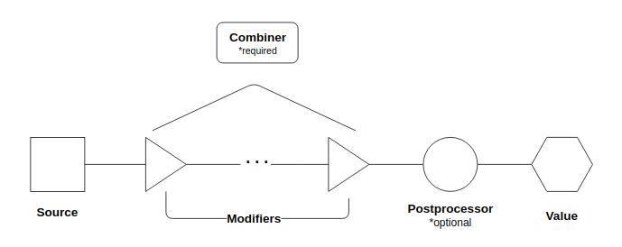

.. _values_concept:

=================
The Values System
=================

The values system provides an interface to an alternative representation of
:term:`state <State Table>` in the simulation: pipelines.
:class:`Pipelines <vivarium.framework.values.Pipeline>` are dynamically
calculated values that can be constructed across multiple
:ref:`components <components_concept>`. This ability for multiple
components to together compose a single value is the biggest advantage
pipelines provide over the standard state representation of the population
state table.

.. note::
   **You should use the values system when you have a value that must be
   composed across multiple components.**

.. contents::
   :depth: 2
   :local:

What are pipelines?
-------------------

We can visualize a pipeline as the following:

At the left, we have the original **source** of the pipeline. This is a
callable registered by a single component that returns a dataframe. To this
source, additional components can register **modifiers**. These modifiers are
also callables that return dataframes.

The source and modifiers are composed into a single value by the **combiner**
with which the pipeline is registered. The combiner is also a callable that
returns a dataframe - it is the function that dictates how the dataframe
produced by the source and the dataframes produced by the modifiers will be
combined into a single dataframe. The combiner also determines the required
signatures of modifiers in relation to the source. The values system provides
three options for combiners, detailed in the following table.

.. list-table:: **Pipeline Combiners**
   :widths: 10 20 20
   :header-rows: 1

   * - Combiner
     - Description
     - Modifier Signature
   * - | :func:`Replace <replace_combiner>`
     - | Replaces the output of the source or modifier with the output of the
       | next modifier. This is the default combiner if none is specified on
       | pipeline registration.
     - | Arguments for the modifiers should be the same as the source with an
       | additional last argument of the results of the previous modifier.
   * - | :func:`List <list_combiner>`
     - | The output of the source should be a list to which the results of the
       | modifiers are appended.
     - | Modifiers should have the same signature as the source.

Pipelines may also optionally be registered with a **postprocessor**. This is
a callable that returns a dataframe that will be called on the output of the
combiner to do some postprocessing.

.. list-table:: **Pipeline Post-processors**
   :widths: 10 50
   :header-rows: 1

   * - Post-processor
     - Description
   * - | :func:`Rescale <rescale_post_processor>`
     - | Used for pipelines that produce rates.  Rescales the rates to the
       | size of the time step. Rates provided by source and modifiers are
       | presumed to be annual.
   * - | :func:`Union <union_post_processor>`
     - | Used for pipelines that produce independent proportions or
       | probabilities. Combines values in a way that is consistent with a
       | union of the underlying sample space

The values system also inverts the direction of control from information that
is stored in the state table. Components that update columns in the state
table can be seen as "pushing" that information out. Pipelines, however, are
"pulled" on by components, often components that did not play any part in the
construction of the pipeline value.

How to use pipelines
--------------------

The values system provides four interface methods, available off the
:ref:`builder <builder_concept>` during setup.

.. list-table:: **Values System Interface Methods**
   :widths: 15 45
   :header-rows: 1

   * - Method
     - Description
   * - | :meth:`register_value_producer <vivarium.framework.values.ValuesInterface.register_value_producer>`
     - | Register a new pipeline with the values system. Provide a name for the
       | pipeline and a source. Optionally provide a combiner (defaults to
       | the replace combiner) and a postprocessor. Provide dependencies (see note).
   * - | :meth:`register_rate_producer <vivarium.framework.values.ValuesInterface.register_rate_producer>`
     - | A special case of :meth:`register_value_producer` for rates specifically.
       | Provide a name for the pipeline and a source and the values system will
       | automatically use the rescale postprocessor. Provide dependencies (see note).
   * - | :meth:`register_value_modifier <vivarium.framework.values.ValuesInterface.register_value_modifier>`
     - | Register a modifier to a pipeline. Provide a name for the pipeline to
       | modify and a modifier callable. Provide dependencies (see note).
   * - | :meth:`get_value <vivarium.framework.values.ValuesInterface.get_value>`
     - | Retrieve a reference to the pipeline with the given name.

.. note::
    The registration methods for the values system require dependencies be
    specified in order for the :ref:`resource manager <resource_concept>` to
    properly order and manage dependencies. These dependencies are the state
    table columns, other pipelines, and randomness streams that the source or
    modifier callable uses in producing the dataframe it returns.

For a view of the values system in action, see the
:ref:`disease model tutorial <disease_model_tutorial>`, specifically the
mortality component.
