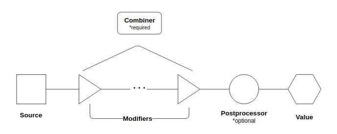

.. _values_concept:

=================
The Values System
=================

The values system provides an interface for working with dynamically calculated
:term:`values <Value>` that can be constructed across multiple :ref:`components <components_concept>`.
A "value" is extremely general in this context and can be anything at all. However,
by far the most common types of values used in a ``Vivarium`` simulation are
:term:`attributes <Attribute>`. Attributes are simulant-specific characteristics
and are stored in the :term:`population state table <Population State Table>`.
Examples of attributes include things such as age, sex, blood pressure, and any
other type of information of interest that describes each simulant.

.. note::
   The values system is distinct from the :ref:`population management system <population_concept>`
   although they are intimately related. While the population system is responsible
   for managing and providing access to the state table, the values system is responsible 
   for populating the columns of said state table with attributes.

As mentioned above, values and attributes are dynamically calculated as needed throughout
the simulation. The most prominent example is any time during the simulation a component
requests some information from the state table, the desired attributes are calculated.
The producers of these values - the things that actually do the calcuations - are
:class:`pipelines <vivarium.framework.values.pipeline.Pipeline>` for generic values
and :class:`attribute pipelines <vivarium.framework.values.pipeline.AttributePipeline>`
for attributes.

.. contents::
   :depth: 2
   :local:

What are pipelines?
-------------------

We can visualize a pipeline as the following:

At the left, we have the original **source** of the pipeline. This is a
callable registered by a single component that can return anything. To this
source, additional components can register **modifiers**. These modifiers are
also callables that can return anything.

The source and modifiers are composed into a single value by the **combiner**
with which the pipeline is registered. The combiner is also a callable that
can return anything - it is the function that dictates how the value
produced by the source and the values produced by the modifiers will be
combined into a single value. The combiner also determines the required
signatures of modifiers in relation to the source. The values system provides
three options for combiners, detailed in the following table.

.. list-table:: **Pipeline Combiners**
   :widths: 10 20 20
   :header-rows: 1

   * - Combiner
     - Description
     - Modifier Signature
   * - | :func:`Replace <vivarium.framework.values.combiners.replace_combiner>`
     - | Replaces the output of the source or modifier with the output of the
       | next modifier. This is the default combiner if none is specified on
       | pipeline registration.
     - | Arguments for the modifiers should be the same as the source with an
       | additional last argument of the results of the previous modifier.
   * - | :func:`List <vivarium.framework.values.combiners.list_combiner>`
     - | The output of the source should be a list to which the results of the
       | modifiers are appended.
     - | Modifiers should have the same signature as the source.

Pipelines may also optionally be registered with a **postprocessor**. This is
a callable that can return anything that will be called on the output of the
combiner to do some postprocessing.

.. list-table:: **Pipeline Post-processors**
   :widths: 10 50
   :header-rows: 1

   * - Post-processor
     - Description
   * - | :func:`Rescale <vivarium.framework.values.post_processors.rescale_post_processor>`
     - | Used for pipelines that produce rates.  Rescales the rates to the
       | size of the time step. Rates provided by source and modifiers are
       | presumed to be annual.
   * - | :func:`Union <vivarium.framework.values.post_processors.union_post_processor>`
     - | Used for pipelines that produce independent proportions or
       | probabilities. Combines values in a way that is consistent with a
       | union of the underlying sample space

What are attribute pipelines?
-----------------------------

An attribute pipeline is a specific type of pipeline whose calculated value is an
attribute, i.e. a simulant-specific characterstic stored in the population state
table such as age, sex, or body-mass index. Attribute pipelines differ from generic
pipelines in that they (and their sources and postprocessors) must accept an index
representing the population of interest and return data in tabular form (i.e. a 
``pandas.DataFrame`` or ``pandas.Series``) with the same index.

By far most pipelines used in ``Vivarium`` simulations are attribute pipelines.

.. note::

    Note that the values system inverts the direction of control from information that
    is stored as private columns in the population manager. Components that update private
    columns via a population view can be seen as "pushing" that information out. Pipelines,
    however, are "pulled" on by components, often components that did not play any part
    in the construction of the pipeline value.

How to use pipelines
--------------------

The values system provides a handful of interface methods, available off the
:ref:`builder <builder_concept>` during setup.

.. list-table:: **Values System Interface Methods**
   :widths: 15 45
   :header-rows: 1

   * - Method
     - Description
   * - | :meth:`register_value_producer <vivarium.framework.values.interface.ValuesInterface.register_value_producer>`
     - | Registers a new pipeline with the values system. Provide a name for the
       | pipeline and a source. Optionally provide a combiner (defaults to
       | the replace combiner) and a postprocessor. Provide required resources (see note).
   * - | :meth:`register_value_producer <vivarium.framework.values.interface.ValuesInterface.register_attribute_producer>`
     - | Registers a new attribute pipeline with the values system. Provide a name
       | for the attribute pipeline and a source. Optionally provide a combiner
       | (defaults to the replace combiner) and a postprocessor. Provide required
       | resources (see note).
   * - | :meth:`register_rate_producer <vivarium.framework.values.interface.ValuesInterface.register_rate_producer>`
     - | A special case of :meth:`register_attribute_producer <vivarium.framework.values.interface.ValuesInterface.register_attribute_producer>`
       | for rates specifically.
       | Provide a name for the pipeline and a source and the values system will
       | automatically use the rescale postprocessor. Provide required resources (see note).
   * - | :meth:`register_value_modifier <vivarium.framework.values.interface.ValuesInterface.register_value_modifier>`
     - | Registers a modifier to a pipeline. Provide a name for the pipeline to
       | modify and a modifier callable. Provide required resources (see note).
   * - | :meth:`register_value_modifier <vivarium.framework.values.interface.ValuesInterface.register_attribute_modifier>`
     - | Registers a modifier to an attribute pipeline. Provide a name for the attribute
       | pipeline to modify and a modifier callable or name of an attribute pipeline
       | that does the modifying. Provide required resources (see note).
   * - | :meth:`get_value <vivarium.framework.values.interface.ValuesInterface.get_value>`
     - | Retrieves the pipeline with the given name.
   * - | :meth:`get_value <vivarium.framework.values.interface.ValuesInterface.get_attribute_pipelines>`
     - | Retrieves a callable that in turn gets a dictionary of all attribute pipelines
       | registered with the values system. This method is intended to be used only
       | by backend managers as needed. Components should not need direct access
       | to attribute pipelines as attributes are obtained via population views.

.. note::
    The registration methods for the values system require that any required resources be
    specified in order for the :ref:`resource manager <resource_concept>` to
    properly order and manage dependencies. These required resources must include
    any private columns, other pipelines or attribute pipelines, :ref:`randomness streams <crn_concept>`,
    and :ref:`lookup tables <lookup_concept>` that the source or modifier callables
    use in producing the value it returns.

For a view of the values system in action, see the
:ref:`disease model tutorial <disease_model_tutorial>`, specifically the
mortality component.
